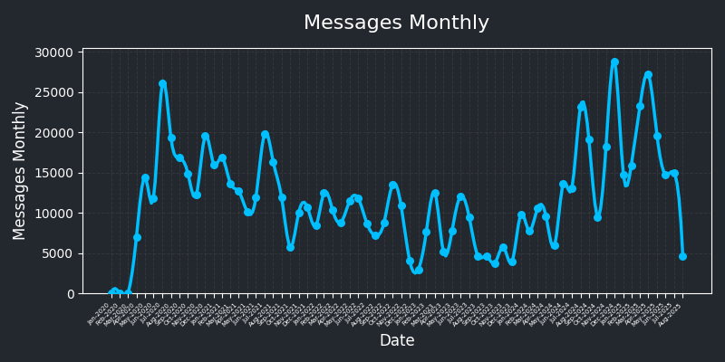
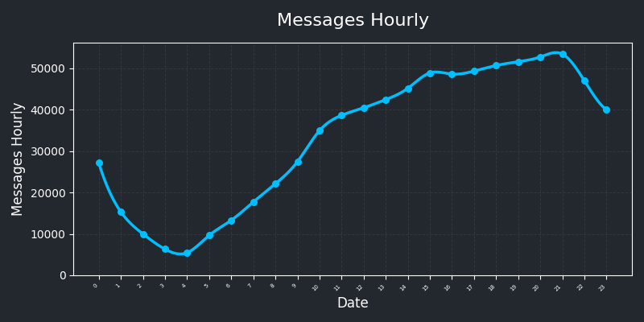
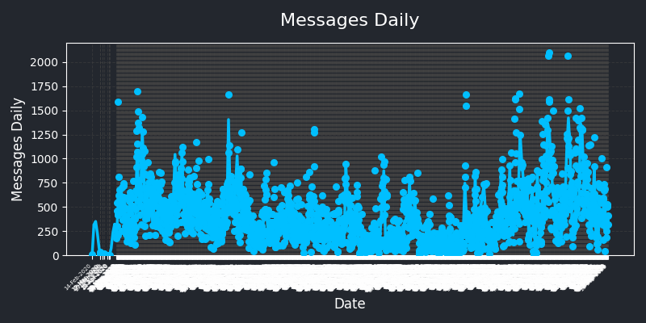
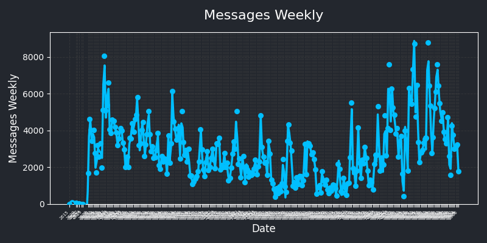

# Discord Data Package Analysis

```python
poetry install
python markov.py
>>> Enter a prompt: (can be empty): hi
>>> hi i love you do <:mchearthug:722801959157104741> <:mchearthug:722801959157104741> <:mchearthug:722801959157104741> <:mchearthug:722801959157104741>
```


```python
poetry install
python count-discord-messages.py
```





